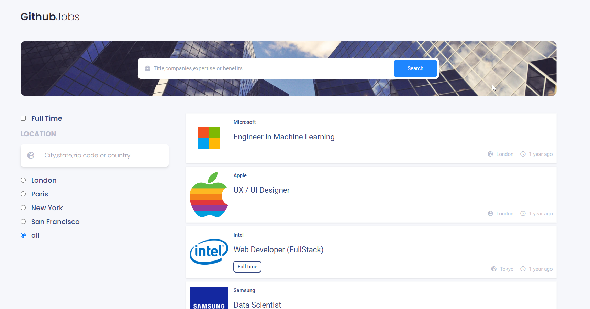

<!-- Please update value in the {}  -->

<h1 align="center">Github job</h1>

<div align="center">
   Solution for a challenge from  <a href="http://devchallenges.io" target="_blank">Devchallenges.io</a>.
</div>

<div align="center">
  <h3>
    <a href="https://job-api-seven.vercel.app/" target="_blank">
      Demo
    </a>
    <span> | </span>
    <a href="https://devchallenges.io/solutions/sNTGopiKGeaQj15QJHHA" target="_blank">
      Solution
    </a>
    <span> | </span>
    <a href="https://devchallenges.io/challenges/TtUjDt19eIHxNQ4n5jps" target="_blank">
      Challenge
    </a>
  </h3>
</div>

<!-- TABLE OF CONTENTS -->

## Table of Contents

- [Overview](#overview)
- [Installation](#installation)
- [Built With](#built-with)
- [Features](#features)
- [Acknowledgements](#acknowledgements)


<!-- OVERVIEW -->

## Overview



#### Installation:

1. Clone the repository:

   ```bash
   git clone https://github.com/render217/job_api
   ```

2. Navigate into the directory and install dependencies:

   ```bash
   npm install
   ```

3. Start the development server:
   ```bash
   npm run dev
   ```

### Built With

<!-- This section should list any major frameworks that you built your project using. Here are a few examples.-->

- **React** 
- **Tailwind**


## Features

<!-- List the features of your application or follow the template. Don't share the figma file here :) -->

This application/site was created as a submission to a [DevChallenges](https://devchallenges.io/challenges) challenge. The [challenge](https://devchallenges.io/challenges/wBunSb7FPrIepJZAg0sY) was to build an application to complete the given user stories.


- [ x ]  User stroy: I can see a list of jobs in a city by default
- [ _ ]  User story: I can search for jobs with a given keyword
- [ _ ]  User story: I can search for jobs with a city name, zip code, or other location
- [ x ]  User story: I can select one option from at least 4 pre-defined options
- [ x ]  User story: I can search for a full-time job only
- [ x ]  User story: I can see a list of jobs with their logo, company name, location, and posted time.
- [ x ]  User story: When I select a job, I can see job descriptions and how to apply like the given design.
- [ x ]  User story: When I am on the job details page, I can go back to the search page
- [ _ ]  User story (optional): I can see a list of jobs in the closest city from my location by default
- [ x ]  User story (optional): I can see jobs on different pages, 5 items on each page

## Acknowledgements
- [Vercel](https://vercel.com/)
- [fakejobsapi (alternative for github jobs api)](https://fakejobsapi.camillerakoto.fr/)

